# DecisionOS — System Architecture & Integration Guide

## 1. Architectural Overview

DecisionOS is an enterprise-grade Decision Command Center structured around a strict separation of concerns between the **Presentation & Interaction Layer (Person A)** and the **Deterministic Decision Engine & Persistence Layer (Person B)**.

```mermaid
flowchart TD
    subgraph Client ["Frontend — Next.js 14 App Router (Person A)"]
        UI["Operating Pages & UI Components\n(/opportunities, /investigation, /scenario, /optimizer, /decisions, /decision-dna)"]
        Hooks["State & Effect Orchestrators"]
        Factory["Central Repository Factory\n(lib/repositories/index.ts)"]
        
        subgraph Repositories ["Domain Repositories"]
            MockRepo["Mock Repositories\n(lib/repositories/mock/*)"]
            ApiRepo["API Client Repositories\n(lib/repositories/api/*)"]
        end
    end

    subgraph Backend ["Backend — FastAPI + Deterministic Decision Engine (Person B)"]
        Router["FastAPI REST Routers\n(/api/v1/*)"]
        AuthMiddleware["JWT RBAC & Workspace Middleware"]
        SolverEngine["Deterministic Optimization & Simulation Solver\n(NumPy / SciPy / PuLP)"]
        MongoStorage[("MongoDB Persistent Store\n(Decisions, DNA, Audits, Workspaces)")]
    end

    UI --> Hooks
    Hooks --> Factory
    Factory -->|NEXT_PUBLIC_USE_MOCK_DATA = true| MockRepo
    Factory -->|NEXT_PUBLIC_USE_MOCK_DATA = false| ApiRepo
    ApiRepo -->|JSON HTTP / Bearer Auth| Router
    Router --> AuthMiddleware
    AuthMiddleware --> SolverEngine
    AuthMiddleware --> MongoStorage
```



---

## 2. Ownership Boundaries

| Dimension | Person A (Frontend Engineer) | Person B (Backend Engineer) |
|---|---|---|
| **Tech Stack** | Next.js 14 (App Router), TypeScript, Tailwind CSS, Radix UI, Lucide Icons | FastAPI, Python 3.11+, MongoDB, NumPy/SciPy/PuLP |
| **Domain Scope** | All 16 pages, rich interactive charts, responsive controls, decision trees, repository interfaces, client error boundaries | Deterministic solver, constraint satisfaction algorithms, Bayesian hypothesis calculator, MongoDB models, JWT auth |
| **Data Contracts** | `types/*.ts`, `lib/repositories/*.ts`, `docs/API_CONTRACT.md` | API schemas (Pydantic), MongoDB ODM (Beanie/Motor), deterministic math pipelines |
| **Mocking Strategy** | Encapsulated in `lib/repositories/mock/*` (no component reads raw mock files directly) | Unit tests against mathematical models & mock seed data generators |

---

## 3. Repository Pattern Implementation

The core architectural invariant established in Phase 12:

> **"Components consume domain data through repository/service interfaces, never directly from mock-data files."**

### 3.1 Repository Structure
- **`lib/repositories/`**: Clean TypeScript interfaces declaring asynchronous domain methods (e.g. `OpportunityRepository`, `ScenarioRepository`, `OptimizerRepository`, `DecisionRepository`, `DecisionDNARepository`).
- **`lib/repositories/mock/`**: In-memory stateful implementations wrapping mock data singletons. Actions such as approving decisions, running optimizer scenarios, or saving configurations mutate the singleton state so changes persist across page transitions during the active browser session.
- **`lib/repositories/api/`**: Concrete fetch implementations configured for the FastAPI backend.
- **`lib/repositories/index.ts`**: Singletons and factory methods (`getOpportunityRepository()`, etc.) that inspect `process.env.NEXT_PUBLIC_USE_MOCK_DATA` to deliver either mock or live instances.

---

## 4. Error Handling & Request State Architecture

### 4.1 Centralized Error Hierarchy (`lib/errors/api-error.ts`)
```typescript
AppError (Base)
  ├── NotFoundError (404)
  ├── ValidationError (400)
  ├── ConstraintViolationError (422)
  └── NetworkError (500/Offline)
```

### 4.2 Generic Request States (`types/request-state.ts`)
Async requests are modeled with explicit state transitions:
`idle` → `loading` → `success` | `error`

Every asynchronous view component isolates its loading skeleton, error retry trigger, and empty states.

---

## 5. Security, RBAC & Multi-Tenancy

1. **Authentication Token Lifecycle**:
   - Stored in secure `httpOnly` session cookies or enterprise authorization headers.
   - Person B will enforce JWT signature checks with role claims: `Executive`, `Strategy_Lead`, `Operator`, `Auditor`.
2. **Multi-Tenancy**:
   - Every API request passes tenant context via `X-Workspace-Id` header.
   - MongoDB documents are strictly partitioned by `workspace_id`.

---

## 6. Real-Time & Streaming Preparedness (Phase 13+)

1. **Long-Running Simulations**:
   - The Scenario Lab and Optimizer interfaces support multi-step staged progress events (`validating_constraints` → `evaluating_configurations` → `comparing_objectives` → `selecting_recommendation`).
   - When Person B connects FastAPI, these steps can stream via Server-Sent Events (SSE) or WebSockets without altering the page layout.
2. **Radar Scanning**:
   - Opportunity continuous discovery can ingest new items asynchronously via background radar webhooks.
