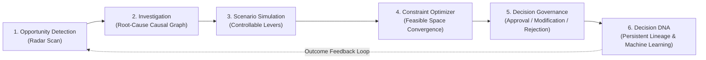

# DecisionOS — Domain Model Specification

## 1. Executive Decision Domain Lifecycle

The DecisionOS core domain models the complete end-to-end journey of an enterprise operational decision:



---

## 2. Core Domain Entities & Relationships

### 2.1 Opportunity (`types/opportunity.ts`)
The initial signal detected by continuous radar algorithms across transactional or CRM datasets.

| Field | Type | Description |
|---|---|---|
| `id` | `string` | Unique internal UUID (e.g. `opp_1`). |
| `code` | `string` | Human-readable identifier (e.g. `OPP-9021`). |
| `title` | `string` | Executive summary headline. |
| `category` | `OpportunityCategory` | `revenue` \| `inventory` \| `pricing` \| `cost` \| `customer`. |
| `urgency` | `OpportunityUrgency` | `critical` \| `high` \| `medium` \| `low`. |
| `status` | `OpportunityStatus` | `open` \| `investigating` \| `in_lab` \| `decision_ready` \| `resolved` \| `dismissed`. |
| `impact.netValue` | `number` | Projected financial value in ₹ INR (e.g., 24,000,000). |
| `impact.confidenceScore` | `number` | Statistical confidence percentage (0–100). |

---

### 2.2 Investigation Workspace (`types/investigation-workspace.ts`)
The root-cause analysis layer explaining *why* an opportunity is occurring.

| Entity | Description |
|---|---|
| `InvestigationWorkspace` | Root container bound to an `opportunityCode`. Holds overall Bayesian confidence, active hypotheses, and causal tree. |
| `InvestigationWorkspaceHypothesis` | Competing explanation (e.g. "Ad Spend Inefficiency") with rank, confidence score, and supporting evidence signals. |
| `InvestigationTreeNode` | Hierarchical causal tree displaying the branching logic from anomaly to root-cause attribution. |
| `InvestigationTimelineEvent` | Chronological telemetry points leading up to the opportunity trigger. |

---

### 2.3 Decision Replay (`types/replay-workspace.ts`)
Historical counterfactual analysis comparing the actual path taken against what would have happened under an alternative policy.

| Entity | Description |
|---|---|
| `HistoricalDecisionSummary` | Snapshot of past approved decision with available counterfactual branches. |
| `ReplayWorkspaceData` | Reconstructed twin timelines (`actualTimeline` vs `counterfactualTimeline`), forked at `decisionPoint`. |
| `ReplayOutcomeMetric` | Concrete delta comparisons (e.g. Profit: Actual ₹18.2 Cr vs Counterfactual ₹22.4 Cr, +₹4.2 Cr). |
| `ReplayProgressionItem` | Empirical sequential evidence logs validating the counterfactual projection. |

---

### 2.4 Scenario Simulation (`types/scenario-workspace.ts`)
Interactive simulation sandbox enabling business executives to adjust controllable levers and project system responses.

| Entity | Description |
|---|---|
| `DecisionLeverValues` | Core controllable parameters: `marketingBudget` (₹ Cr), `workingInventory` (units), `unitPrice` (₹). |
| `ScenarioPreset` | Named archetype configurations (Growth Push, Conservative Cash Buffer, Margin Defense, Baseline). |
| `StateMetricComparison` | Baseline vs Simulated metric pairs with positive/negative delta indicators. |
| `SensitivityDriver` | Lever elasticity rank and sensitivity impact scores. |
| `ScenarioConstraint` | Hard operational bounds (e.g., Working Capital Cap, Service Fill Rate Floor). |
| `SavedScenario` | User-persisted simulation run with custom parameters and timestamped projections. |

---

### 2.5 Constraint-Aware Optimizer (`types/optimizer-workspace.ts`)
The deterministic optimization engine that searches thousands of configurations within the feasible bounded space to maximize or minimize a business objective.

| Entity | Description |
|---|---|
| `OptimizerObjectiveKey` | `maximize_gross_profit` \| `maximize_revenue` \| `maximize_operating_margin` \| `minimize_inventory`. |
| `OptimizerResultRow` | Ranked configuration in the solution space with feasibility classification (`recommended`, `feasible`, `suboptimal`, `infeasible`). |
| `RecommendedConfiguration` | Mathematically optimal configuration satisfying all hard constraints. |
| `OptimizerSearchSummary` | Execution stats: total configs evaluated, feasible count, infeasible count, solver duration. |
| `ParetoPoint` | Multi-objective tradeoff coordinate on the Pareto efficiency frontier. |

---

### 2.6 Decision Registry & Governance (`types/decision-registry.ts`)
Governance record of an optimization configuration awaiting or possessing executive human authorization.

| Field | Type | Description |
|---|---|---|
| `id` | `string` | Unique governance ID (e.g. `dec_01`). |
| `code` | `string` | Human-facing code (e.g. `DEC-2026-MKT-018`). |
| `status` | `DecisionStatus` | `proposed` \| `under_review` \| `approved` \| `modified` \| `rejected` \| `implemented`. |
| `proposedConfig` | `ConfigurationVariables` | Machine-recommended parameters. |
| `modifiedConfig` | `ModifiedConfiguration` (opt) | Overridden parameters entered by the human executive with justification. |
| `rejectionDetails` | `RejectionDetails` (opt) | Formal reason and feedback notes if rejected. |
| `auditTimeline` | `AuditTimelineItem[]` | Immutable log of all human interactions, timestamps, and role sign-offs. |

---

### 2.7 Decision DNA (`types/decision-dna.ts`)
The permanent, auditable system record preserving full decision context and continuous learning loops.

```text
Decision DNA Record (DNA-2026-001)
 ├── 1. Trigger Context (Opportunity OPP-9021)
 ├── 2. Causal Investigation (Hypotheses, Bayesian Confidence)
 ├── 3. Counterfactual Alternatives (Simulated trade-offs)
 ├── 4. Mathematical Optimization (Evaluated configs, hard constraints)
 ├── 5. Human Governance Action (Approver identity, modifications, audit trail)
 ├── 6. Empirical Outcome Telemetry (Actual vs Projected revenue/profit deltas)
 ├── 7. Machine Learning Feedback (Model weight adjustments, calibration updates)
 └── 8. Cryptographic Provenance (SHA-256 integrity digest)
```
